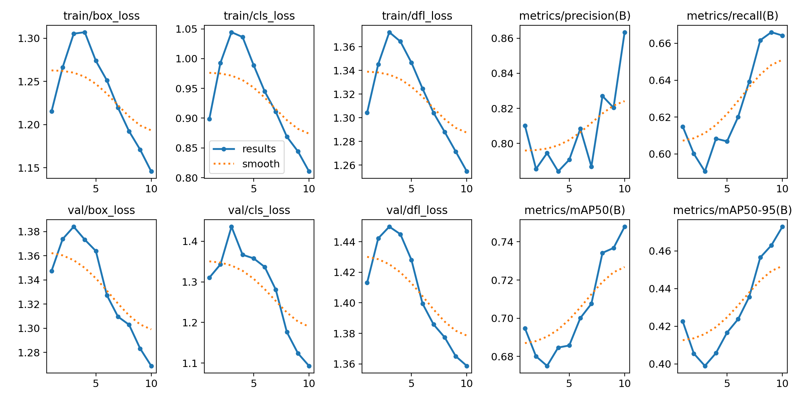
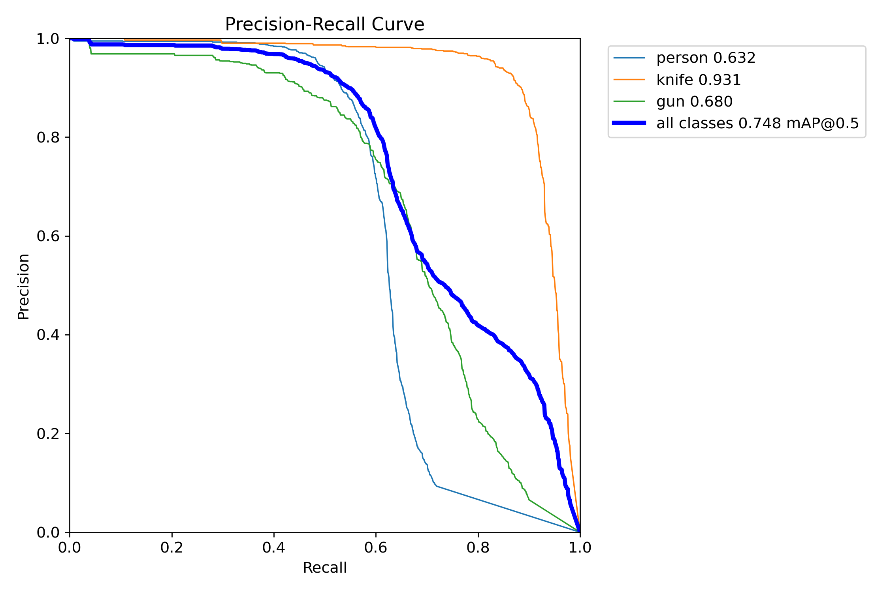
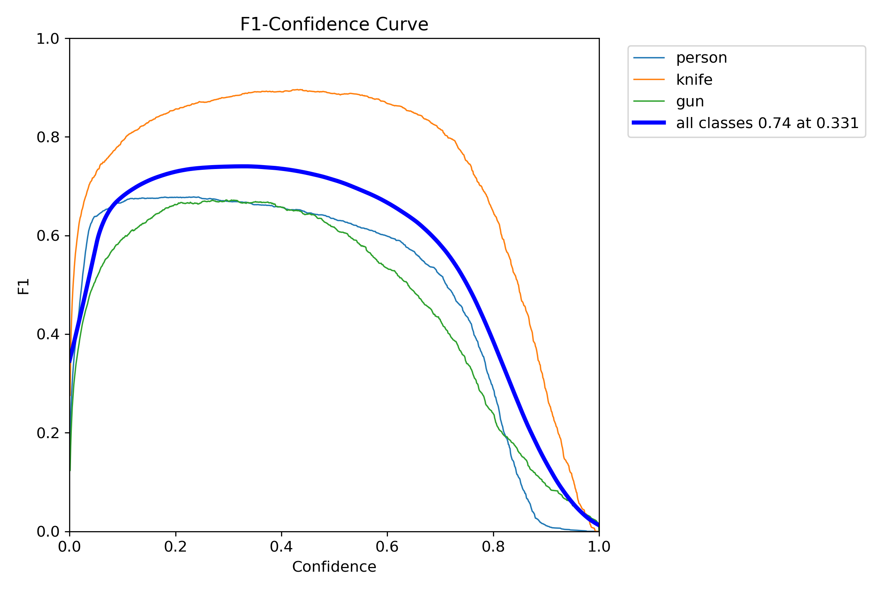
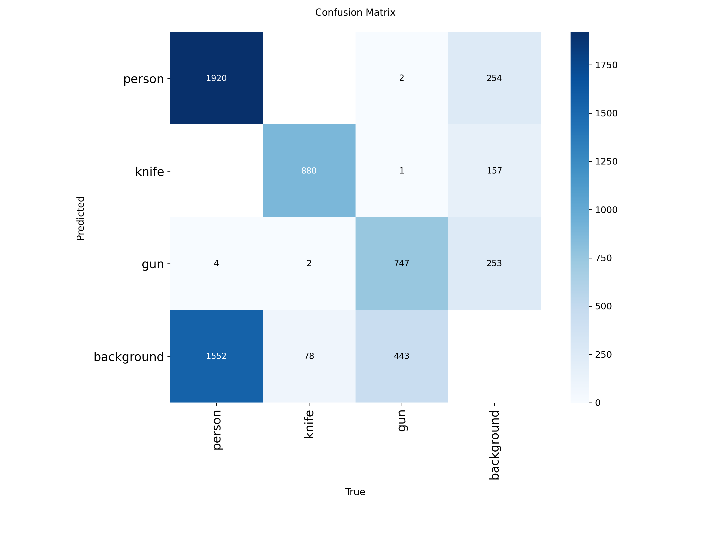
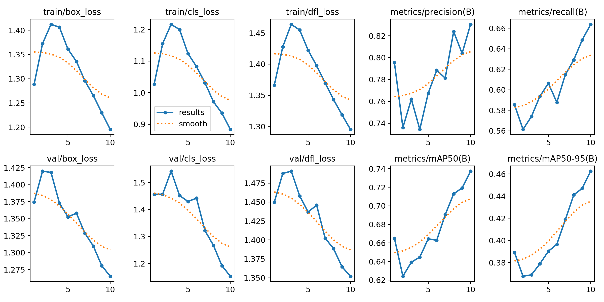
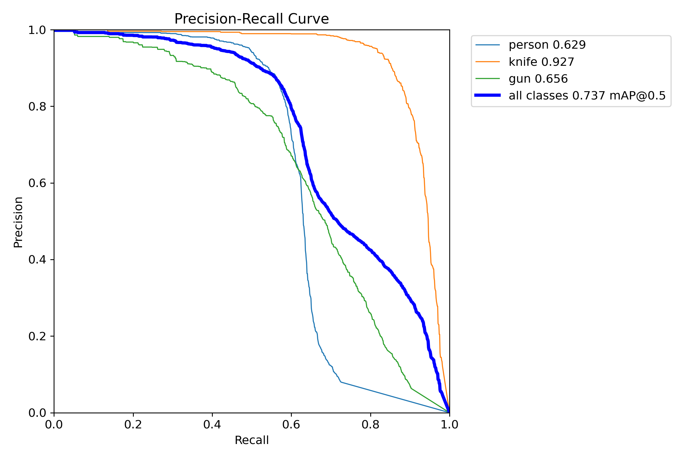

# Smart Security and Surveillance System

### Real-Time Object Detection Using YOLOv8 and OpenCV

A deep learning-based security and surveillance system developed as a Computer Engineering graduation project at **Istinye University**.

The project uses a custom-trained **YOLOv8** model to detect people and potentially dangerous objects in real time through a camera feed. It combines computer vision, object detection, and alert mechanisms to support automated security monitoring.

---

## 1. Project Overview

The system is designed to identify three object classes:

| Class | Description |
|-------|-------------|
| Person | Human detection |
| Knife | Sharp weapon detection |
| Gun | Firearm detection |

The application captures video frames, performs object detection, displays bounding boxes and confidence scores, and applies alert logic when a dangerous object is identified.

### Key Features

- Real-time object detection using a webcam
- Custom YOLOv8 model trained on three object classes
- Bounding box visualization with confidence scores
- Detection filtering to reduce unreliable predictions
- Alert mechanism for potentially dangerous objects
- Training evaluation through performance metrics and visualizations

---

## 2. Technologies and Tools

| Technology | Purpose |
|------------|---------|
| Python | Main programming language |
| YOLOv8 | Object detection |
| PyTorch | Deep learning framework |
| OpenCV | Real-time video processing |
| Ultralytics | Model training and inference |
| Roboflow | Dataset preparation and annotation |
| NumPy | Numerical processing |

---

## 3. System Architecture

The detection pipeline follows these stages:

```text
                  Camera / Webcam
                        |
                        v
                   Frame Capture
                        |
                        v
                  YOLOv8 Inference
                        |
                        v
                Detection Filtering
              (Confidence / Box Area)
                        |
                        v
                Frame Stabilization
                        |
                        v
                   Decision Logic
                        |
               +--------+--------+
               |                 |
               v                 v
         Normal Object     Dangerous Object
               |                 |
               v                 v
          Visualization      Alert System
```

The system processes incoming frames and evaluates predictions before determining whether an alert should be generated.

---

## 4. Dataset and Training

The dataset was assembled from annotated images of people, knives, and guns, using YOLO-compatible annotations.

### Training Process

The project involved multiple training experiments and fine-tuning stages.

Two training runs are included in this repository:

- **Train4:** Previous fine-tuning experiment
- **Train5:** Final model used for the graduation project

Training was performed in a CPU-based environment.

### Model Evaluation

The recorded validation metrics are summarized below.

| Metric | Train4 | Train5 (Final) |
|:-------|-------:|---------------:|
| Precision | 83.05% | **86.3%** |
| Recall | 66.38% | **66.4%** |
| mAP@50 | 73.73% | **74.8%** |
| mAP@50–95 | 46.26% | **47.3%** |

The final training run improved precision and mean Average Precision compared with Train4, while recall remained nearly unchanged.

> These metrics represent validation performance. Results may differ under real-world lighting, camera, and environmental conditions.

---

## 5. Training Results

### Train5 — Final Model

#### Training Metrics



#### Precision–Recall Curve



#### F1–Confidence Curve



#### Confusion Matrix



---

### Train4 — Previous Model

#### Training Metrics



#### Precision–Recall Curve



#### Confusion Matrix


---

## 6. Repository Structure

```text
Smart-Security-and-Surveillance-System/
|
|-- README.md
|-- realtime_detection.py
|-- requirements.txt
|-- data.yaml
|-- best.pt
|-- last.pt
|
|-- merge_and_remap.py
|-- merge_extra.py
|-- negative_add.py
|
|-- train4/
|   |-- args.yaml
|   |-- results.csv
|   |-- results.png
|   |-- BoxPR_curve.png
|   |-- confusion_matrix.png
|   `-- ...
|
`-- train5/
    |-- args.yaml
    |-- results.csv
    |-- results.png
    |-- BoxPR_curve.png
    |-- confusion_matrix.png
    `-- ...
```

---

## 7. Installation and Usage

### Step 1 — Clone the Repository

```bash
git clone https://github.com/sudeilhn/REPOSITORY_NAME.git
cd REPOSITORY_NAME
```

Replace `REPOSITORY_NAME` with the actual repository name.

### Step 2 — Install Dependencies

```bash
pip install -r requirements.txt
```

### Step 3 — Run Real-Time Detection

```bash
python realtime_detection.py
```

**Requirements:**

- Python environment with the required dependencies
- Compatible webcam or camera
- Trained YOLOv8 model weights

Depending on the local configuration, the model path and camera settings may need adjustment.

---

## 8. Limitations and Future Improvements

### Current Limitations

- Detection performance may decrease under poor lighting.
- Small or partially hidden objects can be difficult to detect.
- False positives and missed detections remain possible.
- Inference speed depends on hardware capabilities.

### Future Improvements

- Expand the dataset with more diverse images.
- Improve detection reliability in challenging environments.
- Optimize inference for lower-powered devices.
- Evaluate performance using additional real-world video scenarios.

---

## 9. Academic Information

**Project:** Object Detection-Based Smart Security and Surveillance System

**Institution:** Istinye University

**Department:** Computer Engineering

---

## 10. Author

**Sude İlhan**  
Computer Engineering Graduate | Istinye University
